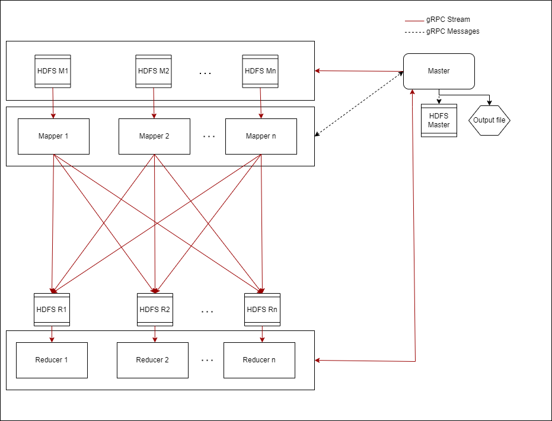

# MapReduce
Ankush Pathak (ankushvpathak@gmail.com)  
***This report is rendered as `README.pdf`.***        

## Design       



### Overview
The overall system comprises four types of processes, namely, Master, Mapper, Reducer, and HDFS. The Master type has a single instance and coordinates the entire system. Mappers, Reducers, and HDFS can have multiple instances. All types of processes are multi-threaded.
The entire system is implemented in C++. A few bash scripts are involved in updating binaries and launching processes on remote hosts.
All processes communicate using gRPC. The master provides a public `MapReduce` service that provides RPC calls to start a map-reduce job or query the status of an ongoing one. The service and message definitions can be found in `Common/Services/MapReduce.proto`.

### Master
In summary, the master process splits the input, moves and spawns appropriate executables on the respective hosts, monitors mappers, and reducers, and finally dumps the output to an HDFS instance and a file.
Configuration options required to start a map-reduce job:       
- `inputFilePath`: The file containing the input for the map-reduce job. Must be directly accessible to the Master process.     
- `mapperFilePath`: The C++ file containing the user-defined map function. Must be directly accessible to the Master process.       
- `reducerFilePath`: The C++ file containing the user-defined reduce function. Must be directly accessible to the Master process.       
- `mappers`: An array of `host` and `port` pairs indicating the desired host location and port of mapper processes.     
- `reducers`: An array of `host` and `port` pairs indicating the desired host location and port of reducer processes.       
- `outputHDFS`: The location of the HDFS server where the Master will dump the output of the map-reduce job.        


Operations performed by the Master:     

0. Compile Mapper and Reducer executables with the user-defined map and reduce functions.
1. Move executables to respective hosts:
      1. Mapper and HDFS executables along with startup bash scripts are moved to Mapper hosts. HDFS processes are started up. All remote processes (Mappers, Reducers, HDFS servers) are started up as daemons on remote hosts through `ssh`.
      2. Reducer and HDFS executables along with startup bash scripts are moved to Reducer hosts. HDFS processes are started up.
      3. Each Mapper and Reducer process is paired with an HDFS process (see figure above). If the Mapper or Reducer process runs on port `p`, then the respective HDFS processes run on port `p - 1`.
2. Input split:     
     1. The input file is split between mappers. Each file split is pushed to the HDFS paired with the respective mapper through gRPC streams.  
     2. The input is split on the number of lines. So each mapper gets roughly the same number of lines of input.
3. Spawn mappers:       
     1. All remote mapper processes are started up. 
     2. Once a mapper process is started, the Master makes an RPC call to each mapper with the following information: the connection tuple to the HDFS paired with the mapper and a list of host & port pairs for all HDFS servers paired with reducers.    
4. Stand a barrier:     
     1. The Master brings up a barrier through a condition variable.
     2. A status checker thread is invoked, this thread periodically checks the status of all mappers. 
     3. The status checker informs some fault tolerance which is described later in the report.
     4. Once mappers indicate that they have mapped their respective input the status checker asks them to terminate through an RPC call. The HDFS instance paired with the mapper is also signaled through RPC to terminate. Once all the mappers are done the status checker signals the condition variable acting as a barrier.
     5. Once the condition variable is signaled by the status checker thread, the Master moves on to the next step.
5. Spawn reducers:      
     1. All remote reducers are started up.
     2. Once they are up, the master makes an RPC call to the reducers with the information required to connect to their paired HDFS instances.
6. Stand the barrier again:     
     1. The barrier is created and waited on as described in point 4.
7. Collect and push results:        
     1. As each reducer indicates that it's done with its work, the status checker collects its results and asks the reducer to terminate along with the reducer's HDFS instance.
     2. Once all reducers are done and the barrier is signaled, the master thread pushes all the results to the HDFS mentioned in the configuration along with a file named `output`.
8. The master is now ready to start another job.

#### Interface
1. The RPC call to start a map-reduce job encapsulates two operations, initializing the cluster and starting the job.
2. The RPC interface provides a procedure to check the status of any ongoing job. Thus, once a job completes, the state is maintained for any status queries.
3. On starting a new map reduce job, the older state is destroyed, if it exists.        

### HDFS
1. HDFS is a memcache implementation with some additional features. 
2. Along with, the `get` and `set` primitives, the service now also supports `append` operation and has an RPC interface.

### Mapper
1. The Mapper is a multi-threaded process spawned by the Master, on the same or different host.
2. Once the process comes up, it starts its RPC server. The first RPC request it expects is the configuration from the master. This configuration has the details of the HDFS instance paired with it and the list of HDFS instances paired with the Reducers.
3. The Mapper then starts streaming records from its HDFS instance and Maps them.
4. While the records are being processed, the master's status checker may query the progress of the map operation. The mapper responds with the percent of the total work done.
5. Once the records are mapped, the result is streamed to the respective HDFS instances paired with Reducers. The key of each result is hashed to determine the reducer that will receive it.
6. Once its job is done, the mapper idles and waits for the RPC call from the master telling the mapper to terminate.

### Reducer
1. The reducer starts up and waits for an RPC call from the Master. The RPC call contains the connection string to connect to its own HDFS instance.
2. The reducer then streams the mapped records from HDFS and reduces them. Once the reducer is done, on RPC request from Master the result is streamed to the Master process.
3. After receiving the result, the Master instructs the reducer to terminate.

### Fault tolerance
1. The status checker thread in the master maintains the state information of mappers and reducers. 
2. If a mapper or reducer reports the same state of progress over multiple periodic checks, the remote process is restarted.
3. If a mapper or reducer has to be restarted more than three times the master assumes there's something fundamentally wrong and cancels the entire job.

### Templates for Map & Reduce files
Map function signature:
```
#include "Map.h"

void Map::map(
    const std::string &lineOffset, 
    const std::string &line, pairs &keyValuePairs) 
{
    // User code for map
    // keyValuePairs is a vector of string pairs. 
    // The result of the map operation can be pushed to keyValuePairs.
}
```
Reduce function signature: 
```
#include "Reduce.h"

std::string Reduce::reduce(
    const std::string &key, 
    const std::vector<std::string> &values) 
{
    // User code for reduce
}   
```     

- The path of the files containing the map and reduce function are passed to the Master as config parameters, as mentioned earlier. The files should be directly accessible to the Master process.
- Implementing a new map reduce operation is as simple as rewriting these two simple functions. Thus, the user can implement their own functions and provide the location of their implementations when triggering the map reduce job.      

## Driver script
1. The driver script executes the following steps:
     1. It first builds the code. The CMake build script fetches and builds gRPC codebase along with the assignment code. This takes a while (can be as long as 10 minutes).
     2. Once the code is built, a gRPC client is downloaded to trigger the jobs.
     3. The script then autogenerates input files of a set size(10 MB and 20 MB).
     4. A request JSON is created from a template (`driver_artifacts/start_req.json`). This request configures two mappers and two reducers.
     5. The Master process is started.
     6. The gRPC client is used to start a MapReduce job.
     7. The driver monitors the Master log. The monitoring continues unless the log indicates that the job is done or the master process times out (due to some failure).
     8. The residual files and processes of the map reduce job are cleaned up.
2. The execution uses two directories, `~/.mapreduce` and `build` directories inside the assignment directory. The `~/.mapreduce` directory has all non-master logs and HDFS dumps. The `output` file in `build/backup[TIMESTAMP]` has the output of the job. Each line has a new record (word), followed by the reduction result. For word count that will be the count, for inverted index it will be the byte offsets where the word was found.
3. The logs and HDFS dumps are backed up after each run.
4. The driver runs two jobs, Word Count and Inverted Index on each input file.
5. Log file naming convention is `[Process name][Port].log` for ex. `master4000.log`.       

### Usage
**Assumption:** Passwordless SSH login for the current user to `localhost` is set up. See the appendix for quick instructions on setting this up. 

Running the driver script: Change into the `driver_artifacts` directory and run the command `bash driver.sh`

**Note:** All the scripts and code were tested on `silo.sice.indiana.edu`.

## Compare and contrast with the MapReduce library from the Google paper
1. The signatures of the Map and Reduce functions is the same as the paper describes.
2. The library divides the input into blocks of 16 MB to 64 MB, while my implementation does it based on lines and tries to divide the input equally amongst all mappers.
3. The use of the library leads to a single executable that has master, mapper, and reducer code. The distinction between types of processes happens after the respective processes are forked. In my implementation, each type of process has a different executable. 
4. Mappers push their buffers to the local disk in the library. The mappers in my implementation push results to HDFS which is supposed to be a network reachable service.
5. The library provides final output as different files, one for each reducer, while my implementation pushes all the results to a single file and HDFS.
6. In the library implementation, the location and size of intermediate files are updated as the task progresses. In my implementation, the master pre-mediates the output location of the mappers, and reducers.
7. The library implementation checks on mappers periodically, which is the same in my implementation. If a task fails, it is restarted. On restart mappers will overwrite the intermediate output. The library implementation informs tasks of restart if there is a dependency, which my implementation does not.
8. The library implementation and my implementation track task states similarly (through states idle, in-progress or completed).
9. The paper describes the use of backup tasks to improve performance in the face of failures. My implementation does not use backup tasks, and the progress of a chunk is reset when the mapper crashes.
10. The reference implementation, can inform the rest of the system of bad records that cause crashes through UDP "gasps". My implementation is entirely reliant on TCP-based RPC communication and the current design cannot readily accomodate it.
11. The library performance was evaluated on real clusters, however, I have tested my implementation on a single host, Silo.
12. The library implementation can also deal with machine failures by redistributing work, which is not handled in my implementation.
13. The library provides instrumentation through various custom counters, this is not accommodated in my implementation.
14. The combiner function in my implementation is done implicitly through the key-value store in the HDFS. The store ensures keys are unique and allows appending results to the same key. The "combining" results automatically for the reducer. This is different from the approach implemented in the library which can use an explicit combiner function.

## Limitations and future improvements
1. The current status checker can handle only a few failure states of the reducer and the mapper.
2. Status update communication can be mapper/reducer initiated, eliminating the need for network polling from the master. If the master doesn't hear from the mapper/reducer for some time, it can assume it has crashed.
3. The input data to the system is currently a single file. This can become cumbersome to manage for the user as the input size grows. The master can be modified to read from multiple specified files.
4. The reducer communicates each result record as a single message. However, if a single result record has a length beyond the allowed message length of gRPC, the communication fails. Each result value can be streamed in chunks instead of a single message.

## Appendix
1. Setting up passwordless login to `localhost`
    ```
    $ ssh-keygen # Press enter for each prompt ("n" if it asks for a overwrite)
    $ cat ~/.ssh/id_rsa.pub >> ~/.ssh/authorized_keys
    $ ssh localhost # Yes, if there's a prompt, missing this step will block the passwordless ssh connection in the future for a user prompt
    # Close the terminal or Ctrl + D
    ```
2. Sample logs included in `logs` directory: 
Sample master log and corressponding driver log from `logs`:
```
[20:36:49 -04:00] [] [---I---] [thread 2222309] Server up on: 4100
[20:36:49 -04:00] [] [---I---] [thread 2222333] Invoking MapReduce thread
[20:36:49 -04:00] [] [---I---] [thread 2222341] Starting MapReduce
[20:36:49 -04:00] [] [---I---] [thread 2222341] Compiling Mapper and Reducer
[20:37:08 -04:00] [] [---I---] [thread 2222341] Mapper init done
[20:37:08 -04:00] [] [---I---] [thread 2222341] Reducer init done
[20:37:08 -04:00] [] [---I---] [thread 2222341] Moving mapper stuff to target host localhost
[20:37:14 -04:00] [] [---I---] [thread 2222341] Starting HDFS on localhost:2599
[20:37:15 -04:00] [] [---I---] [thread 2222341] Moving mapper stuff to target host localhost
[20:37:20 -04:00] [] [---I---] [thread 2222341] Starting HDFS on localhost:2699
[20:37:22 -04:00] [] [---I---] [thread 2222341] Moving reducer stuff to target host localhost
[20:37:27 -04:00] [] [---I---] [thread 2222341] Starting HDFS on localhost:3599
[20:37:28 -04:00] [] [---I---] [thread 2222341] Moving reducer stuff to target host localhost
[20:37:33 -04:00] [] [---I---] [thread 2222341] Starting HDFS on localhost:3699
[20:37:34 -04:00] [] [---I---] [thread 2222341] Starting input processing
[20:37:34 -04:00] [] [---I---] [thread 2222341] Working on input for mapper 1, split size: 1829 of 3659
[20:37:34 -04:00] [] [---I---] [thread 2222341] Pushed: 1829 lines
[20:37:34 -04:00] [] [---I---] [thread 2222341] Working on input for last mapper
[20:37:34 -04:00] [] [---I---] [thread 2222341] Pushed: 1829 lines
[20:37:34 -04:00] [] [---I---] [thread 2222341] Starting mapper: localhost:2600
[20:37:38 -04:00] [] [---I---] [thread 2222341] Configuring mapper: localhost:2600
[20:37:38 -04:00] [] [---I---] [thread 2222341] Mapper Done: 0%
[20:37:38 -04:00] [] [---I---] [thread 2222341] Starting mapper: localhost:2700
[20:37:42 -04:00] [] [---I---] [thread 2222341] Configuring mapper: localhost:2700
[20:37:42 -04:00] [] [---I---] [thread 2222341] Mapper Done: 0%
[20:37:42 -04:00] [] [---I---] [thread 2222341] Invoking status checker
[20:37:42 -04:00] [] [---I---] [thread 2222341] Starting Map status checking thread
[20:37:42 -04:00] [] [---I---] [thread 2222341] Bringing barrier up
[20:37:42 -04:00] [] [---I---] [thread 2232212] Checking in on working mapper: localhost:2600
[20:37:42 -04:00] [] [---I---] [thread 2232212] Mapper localhost:2600 done: 100%
[20:37:42 -04:00] [] [---I---] [thread 2232212] Mapper localhost:2600 says it's dying
[20:37:48 -04:00] [] [---I---] [thread 2232212] Checking in on working mapper: localhost:2700
[20:37:48 -04:00] [] [---I---] [thread 2232212] Mapper localhost:2700 done: 100%
[20:37:48 -04:00] [] [---I---] [thread 2232212] Mapper localhost:2700 says it's dying
[20:37:54 -04:00] [] [---I---] [thread 2232212] Mappers done
[20:37:54 -04:00] [] [---I---] [thread 2222341] Barrier is down
[20:37:54 -04:00] [] [---I---] [thread 2222341] Starting reducer: localhost:3600
[20:37:58 -04:00] [] [---I---] [thread 2222341] Configuring reducer: localhost:3600
[20:37:58 -04:00] [] [---I---] [thread 2222341] Reducer Done: 0%
[20:37:58 -04:00] [] [---I---] [thread 2222341] Starting reducer: localhost:3700
[20:38:02 -04:00] [] [---I---] [thread 2222341] Configuring reducer: localhost:3700
[20:38:02 -04:00] [] [---I---] [thread 2222341] Reducer Done: 0%
[20:38:02 -04:00] [] [---I---] [thread 2222341] Invoking status checker
[20:38:02 -04:00] [] [---I---] [thread 2222341] Starting Reducer status checking thread
[20:38:02 -04:00] [] [---I---] [thread 2222341] Bringing barrier up
[20:38:02 -04:00] [] [---I---] [thread 2233008] Checking in on working reducer: localhost:3600
[20:38:02 -04:00] [] [---I---] [thread 2233008] Reducer localhost:3600 done: 100%
[20:38:02 -04:00] [] [---I---] [thread 2233008] Collected results from: localhost:3600 Size: 3637
[20:38:02 -04:00] [] [---I---] [thread 2233008] Reducer localhost:3600 says it's dying
[20:38:08 -04:00] [] [---I---] [thread 2233008] Checking in on working reducer: localhost:3700
[20:38:08 -04:00] [] [---I---] [thread 2233008] Reducer localhost:3700 done: 100%
[20:38:08 -04:00] [] [---I---] [thread 2233008] Collected results from: localhost:3700 Size: 7309
[20:38:08 -04:00] [] [---I---] [thread 2233008] Reducer localhost:3700 says it's dying
[20:38:14 -04:00] [] [---I---] [thread 2233008] Reducers done
[20:38:14 -04:00] [] [---I---] [thread 2222341] Barrier is down
[20:38:17 -04:00] [] [---I---] [thread 2222341] Results pushed to HDFS localhost:4500
[20:38:17 -04:00] [] [---I---] [thread 2222341] Run took: 88133 ms

```

```
------------------------------------------
Building code...
-- Populating grpc
-- Configuring done
-- Generating done
-- Build files have been written to: /nfs/nfs8/home/scratch/ankpath/ECC/Assignment2/build/_deps/grpc-subbuild
[ 11%] Performing update step for 'grpc-populate'
[ 22%] No configure step for 'grpc-populate'
[ 33%] No build step for 'grpc-populate'
[ 44%] No install step for 'grpc-populate'
[ 55%] No test step for 'grpc-populate'
[ 66%] Completed 'grpc-populate'
[100%] Built target grpc-populate
-- 
-- 3.21.6.0
-- Configuring done
-- Generating done
-- Build files have been written to: /u/ankpath/ECC/Assignment2/build
[  0%] Built target address_sorting
[  1%] Built target absl_log_severity
[  1%] Built target absl_strerror
[  2%] Built target absl_random_internal_platform
[  2%] Built target absl_exponential_biased
[  2%] Built target absl_spinlock_wait
[  2%] Built target zlibstatic
[  2%] Built target absl_random_seed_gen_exception
[  3%] Built target absl_civil_time
[  3%] Built target absl_int128
[  3%] Built target absl_time_zone
[  5%] Built target upb
[  5%] Built target re2
[  8%] Built target c-ares
[  8%] Built target absl_leak_check
[  9%] Built target absl_flags_commandlineflag_internal
[  9%] Built target ssl
[  9%] Built target absl_periodic_sampler
[ 10%] Built target absl_random_internal_randen_hwaes_impl
[ 10%] Built target zlib
[ 10%] Built target absl_random_internal_randen_slow
[ 10%] Built target absl_raw_logging_internal
[ 10%] Built target testing
[ 13%] Built target adig
[ 13%] Built target acountry
[ 13%] Built target libprotobuf-lite
[ 13%] Built target ahost
[ 13%] Built target absl_random_internal_randen_hwaes
[ 13%] Built target minigzip64
[ 13%] Built target minigzip
[ 13%] Built target example
[ 13%] Built target example64
[ 13%] Built target absl_throw_delegate
[ 13%] Built target absl_bad_variant_access
[ 14%] Built target absl_base
[ 14%] Built target absl_debugging_internal
[ 16%] Built target absl_bad_optional_access
[ 16%] Built target absl_cordz_functions
[ 18%] Built target absl_scoped_set_env
[ 18%] Built target libprotobuf
[ 18%] Built target absl_bad_any_cast_impl
[ 18%] Built target search_test
[ 18%] Built target regexp_test
[ 18%] Built target mimics_pcre_test
[ 18%] Built target parse_test
[ 18%] Built target required_prefix_test
[ 18%] Built target possible_match_test
[ 18%] Built target filtered_re2_test
[ 18%] Built target re2_arg_test
[ 18%] Built target exhaustive1_test
[ 18%] Built target compile_test
[ 18%] Built target charclass_test
[ 18%] Built target re2_test
[ 19%] Built target simplify_test
[ 19%] Built target string_generator_test
[ 20%] Built target dfa_test
[ 21%] Built target exhaustive_test
[ 21%] Built target exhaustive3_test
[ 21%] Built target exhaustive2_test
[ 21%] Built target regexp_benchmark
[ 22%] Built target random_test
[ 22%] Built target set_test
[ 22%] Built target absl_malloc_internal
[ 23%] Built target absl_strings_internal
[ 23%] Built target absl_stacktrace
[ 23%] Built target absl_demangle_internal
[ 24%] Built target absl_random_internal_randen
[ 24%] Built target absl_low_level_hash
[ 24%] Built target absl_city
[ 24%] Built target absl_graphcycles_internal
[ 25%] Built target absl_strings
[ 36%] Built target crypto
[ 36%] Built target absl_symbolize
[ 36%] Built target absl_random_distributions
[ 36%] Built target absl_flags_commandlineflag
[ 36%] Built target absl_random_internal_seed_material
[ 36%] Built target absl_time
[ 36%] Built target absl_str_format_internal
[ 36%] Built target absl_hash
[ 36%] Built target absl_cord_internal
[ 37%] Built target bssl
[ 41%] Built target libprotoc
[ 41%] Built target absl_examine_stack
[ 41%] Built target absl_flags_private_handle_accessor
[ 41%] Built target absl_random_internal_pool_urbg
[ 42%] Built target absl_random_internal_distribution_test_util
[ 42%] Built target absl_synchronization
[ 42%] Built target absl_flags_marshalling
[ 42%] Built target protoc
[ 42%] Built target absl_failure_signal_handler
[ 42%] Built target grpc_plugin_support
[ 42%] Built target absl_random_seed_sequences
[ 42%] Built target absl_cordz_handle
[ 42%] Built target absl_hashtablez_sampler
[ 42%] Built target absl_flags_program_name
[ 42%] Built target grpc_cpp_plugin
[ 42%] Built target grpc_node_plugin
[ 42%] Built target grpc_python_plugin
[ 42%] Built target grpc_php_plugin
[ 42%] Built target grpc_objective_c_plugin
[ 42%] Built target absl_flags_config
[ 42%] Built target grpc_csharp_plugin
[ 43%] Built target absl_raw_hash_set
[ 43%] Built target grpc_ruby_plugin
[ 43%] Built target absl_cordz_info
[ 44%] Built target absl_flags_internal
[ 44%] Built target absl_cordz_sample_token
[ 44%] Built target absl_cord
[ 44%] Built target absl_status
[ 44%] Built target absl_flags_reflection
[ 44%] Built target absl_flags
[ 44%] Built target absl_statusor
[ 46%] Built target gpr
[ 46%] Built target absl_flags_usage_internal
[ 46%] Built target absl_flags_usage
[ 46%] Built target absl_flags_parse
[ 60%] Built target grpc_unsecure
[ 62%] Built target grpc++_unsecure
[ 93%] Built target grpc
[ 94%] Built target gen_hpack_tables
[ 97%] Built target grpc++
[ 97%] Built target grpc++_error_details
[ 97%] Built target grpc++_alts
[ 98%] Built target grpc++_reflection
[ 98%] Built target grpcpp_channelz
[ 98%] Built target mr_grpc_proto
[ 98%] Built target HDFS
[ 99%] Built target Reducer
[ 99%] Built target Master
[100%] Built target Mapper
Build done
/u/ankpath/ECC/Assignment2/driver_artifacts

------------------------------------------


------------------------------------------
Setting up grpc-client-cli

------------------------------------------

Starting Word Count with input /u/ankpath/ECC/Assignment2/driver_artifacts/../build/input_file_10MB.txt


------------------------------------------
Creating Map Reduce config

------------------------------------------


------------------------------------------
Starting master
/u/ankpath/ECC/Assignment2/driver_artifacts

------------------------------------------


------------------------------------------
Making gRPC request to start MapReduce job
{
  "timestamp": "1665448488365",
  "healthyMappers": 0,
  "totalMappers": 0,
  "healthyReducers": 0,
  "totalReducers": 0,
  "averageMappingPercentageDone": 0,
  "averageReducingPercentageDone": 0
}

------------------------------------------


------------------------------------------
Starting Master monitor
[20:34:48 -04:00] [] [---I---] [thread 2201449] Server up on: 4100
[20:34:48 -04:00] [] [---I---] [thread 2188033] Invoking MapReduce thread
[20:34:48 -04:00] [] [---I---] [thread 2201480] Starting MapReduce
[20:34:48 -04:00] [] [---I---] [thread 2201480] Compiling Mapper and Reducer
[20:34:48 -04:00] [] [---I---] [thread 2201449] Server up on: 4100
[20:34:48 -04:00] [] [---I---] [thread 2188033] Invoking MapReduce thread
[20:34:48 -04:00] [] [---I---] [thread 2201480] Starting MapReduce
[20:34:48 -04:00] [] [---I---] [thread 2201480] Compiling Mapper and Reducer
[20:34:48 -04:00] [] [---I---] [thread 2201449] Server up on: 4100
[20:34:48 -04:00] [] [---I---] [thread 2188033] Invoking MapReduce thread
[20:34:48 -04:00] [] [---I---] [thread 2201480] Starting MapReduce
[20:34:48 -04:00] [] [---I---] [thread 2201480] Compiling Mapper and Reducer
[20:35:07 -04:00] [] [---I---] [thread 2201480] Mapper init done
[20:35:07 -04:00] [] [---I---] [thread 2201480] Reducer init done
[20:35:07 -04:00] [] [---I---] [thread 2201480] Moving mapper stuff to target host localhost
[20:34:48 -04:00] [] [---I---] [thread 2188033] Invoking MapReduce thread
[20:34:48 -04:00] [] [---I---] [thread 2201480] Starting MapReduce
[20:34:48 -04:00] [] [---I---] [thread 2201480] Compiling Mapper and Reducer
[20:35:07 -04:00] [] [---I---] [thread 2201480] Mapper init done
[20:35:07 -04:00] [] [---I---] [thread 2201480] Reducer init done
[20:35:07 -04:00] [] [---I---] [thread 2201480] Moving mapper stuff to target host localhost
[20:35:13 -04:00] [] [---I---] [thread 2201480] Starting HDFS on localhost:2599
[20:35:14 -04:00] [] [---I---] [thread 2201480] Moving mapper stuff to target host localhost
[20:35:19 -04:00] [] [---I---] [thread 2201480] Starting HDFS on localhost:2699
[20:35:20 -04:00] [] [---I---] [thread 2201480] Moving reducer stuff to target host localhost
[20:35:14 -04:00] [] [---I---] [thread 2201480] Moving mapper stuff to target host localhost
[20:35:19 -04:00] [] [---I---] [thread 2201480] Starting HDFS on localhost:2699
[20:35:20 -04:00] [] [---I---] [thread 2201480] Moving reducer stuff to target host localhost
[20:35:25 -04:00] [] [---I---] [thread 2201480] Starting HDFS on localhost:3599
[20:35:26 -04:00] [] [---I---] [thread 2201480] Moving reducer stuff to target host localhost
[20:35:31 -04:00] [] [---I---] [thread 2201480] Starting HDFS on localhost:3699
[20:35:32 -04:00] [] [---I---] [thread 2201480] Starting input processing
[20:35:32 -04:00] [] [---I---] [thread 2201480] Working on input for mapper 1, split size: 1829 of 3659
[20:35:32 -04:00] [] [---I---] [thread 2201480] Pushed: 1829 lines
[20:35:32 -04:00] [] [---I---] [thread 2201480] Working on input for last mapper
[20:35:36 -04:00] [] [---I---] [thread 2201480] Mapper Done: 0%
[20:35:36 -04:00] [] [---I---] [thread 2201480] Starting mapper: localhost:2700
[20:35:40 -04:00] [] [---I---] [thread 2201480] Configuring mapper: localhost:2700
[20:35:40 -04:00] [] [---I---] [thread 2201480] Mapper Done: 0%
[20:35:40 -04:00] [] [---I---] [thread 2201480] Invoking status checker
[20:35:40 -04:00] [] [---I---] [thread 2201480] Starting Map status checking thread
[20:35:40 -04:00] [] [---I---] [thread 2201480] Bringing barrier up
[20:35:40 -04:00] [] [---I---] [thread 2216589] Checking in on working mapper: localhost:2600
[20:35:40 -04:00] [] [---I---] [thread 2216589] Mapper localhost:2600 done: 100%
[20:35:40 -04:00] [] [---I---] [thread 2216589] Mapper localhost:2600 says it's dying
[20:35:40 -04:00] [] [---I---] [thread 2201480] Bringing barrier up
[20:35:40 -04:00] [] [---I---] [thread 2216589] Checking in on working mapper: localhost:2600
[20:35:40 -04:00] [] [---I---] [thread 2216589] Mapper localhost:2600 done: 100%
[20:35:40 -04:00] [] [---I---] [thread 2216589] Mapper localhost:2600 says it's dying
[20:35:46 -04:00] [] [---I---] [thread 2216589] Checking in on working mapper: localhost:2700
[20:35:46 -04:00] [] [---I---] [thread 2216589] Mapper localhost:2700 done: 100%
[20:35:46 -04:00] [] [---I---] [thread 2216589] Mapper localhost:2700 says it's dying
[20:35:52 -04:00] [] [---I---] [thread 2216589] Mappers done
[20:35:52 -04:00] [] [---I---] [thread 2201480] Barrier is down
[20:35:52 -04:00] [] [---I---] [thread 2201480] Starting reducer: localhost:3600
[20:35:57 -04:00] [] [---I---] [thread 2201480] Starting reducer: localhost:3700
[20:36:01 -04:00] [] [---I---] [thread 2201480] Configuring reducer: localhost:3700
[20:36:01 -04:00] [] [---I---] [thread 2201480] Reducer Done: 0%
[20:36:01 -04:00] [] [---I---] [thread 2201480] Invoking status checker
[20:36:01 -04:00] [] [---I---] [thread 2201480] Starting Reducer status checking thread
[20:36:01 -04:00] [] [---I---] [thread 2201480] Bringing barrier up
[20:36:01 -04:00] [] [---I---] [thread 2218719] Checking in on working reducer: localhost:3600
[20:36:01 -04:00] [] [---I---] [thread 2218719] Reducer localhost:3600 done: 100%
[20:36:01 -04:00] [] [---I---] [thread 2218719] Collected results from: localhost:3600 Size: 11846
[20:36:01 -04:00] [] [---I---] [thread 2218719] Reducer localhost:3600 says it's dying
[20:36:01 -04:00] [] [---I---] [thread 2218719] Checking in on working reducer: localhost:3600
[20:36:01 -04:00] [] [---I---] [thread 2218719] Reducer localhost:3600 done: 100%
[20:36:01 -04:00] [] [---I---] [thread 2218719] Collected results from: localhost:3600 Size: 11846
[20:36:01 -04:00] [] [---I---] [thread 2218719] Reducer localhost:3600 says it's dying
[20:36:07 -04:00] [] [---I---] [thread 2218719] Checking in on working reducer: localhost:3700
[20:36:07 -04:00] [] [---I---] [thread 2218719] Reducer localhost:3700 done: 100%
[20:36:07 -04:00] [] [---I---] [thread 2218719] Collected results from: localhost:3700 Size: 23855
[20:36:07 -04:00] [] [---I---] [thread 2218719] Reducer localhost:3700 says it's dying
[20:36:13 -04:00] [] [---I---] [thread 2218719] Reducers done
[20:36:13 -04:00] [] [---I---] [thread 2201480] Barrier is down
[20:36:01 -04:00] [] [---I---] [thread 2218719] Collected results from: localhost:3600 Size: 11846
[20:36:01 -04:00] [] [---I---] [thread 2218719] Reducer localhost:3600 says it's dying
[20:36:07 -04:00] [] [---I---] [thread 2218719] Checking in on working reducer: localhost:3700
[20:36:07 -04:00] [] [---I---] [thread 2218719] Reducer localhost:3700 done: 100%
[20:36:07 -04:00] [] [---I---] [thread 2218719] Collected results from: localhost:3700 Size: 23855
[20:36:07 -04:00] [] [---I---] [thread 2218719] Reducer localhost:3700 says it's dying
[20:36:13 -04:00] [] [---I---] [thread 2218719] Reducers done
[20:36:13 -04:00] [] [---I---] [thread 2201480] Barrier is down
[20:36:17 -04:00] [] [---I---] [thread 2201480] Results pushed to HDFS localhost:4500
[20:36:17 -04:00] [] [---I---] [thread 2201480] Run took: 89271 ms
Job done

------------------------------------------


------------------------------------------
Cleaning up residual processes, this may cause armageddon

------------------------------------------


------------------------------------------
Resetting environment

------------------------------------------

Word Count with input /u/ankpath/ECC/Assignment2/driver_artifacts/../build/input_file_10MB.txt done
Starting Inverted Index with input /u/ankpath/ECC/Assignment2/driver_artifacts/../build/input_file_10MB.txt


------------------------------------------
Creating Map Reduce config

------------------------------------------


------------------------------------------
Starting master
/u/ankpath/ECC/Assignment2/driver_artifacts

------------------------------------------


------------------------------------------
Making gRPC request to start MapReduce job
{
  "timestamp": "1665448609409",
  "healthyMappers": 0,
  "totalMappers": 0,
  "healthyReducers": 0,
  "totalReducers": 0,
  "averageMappingPercentageDone": 0,
  "averageReducingPercentageDone": 0
}

------------------------------------------


------------------------------------------
Starting Master monitor
[20:36:49 -04:00] [] [---I---] [thread 2222309] Server up on: 4100
[20:36:49 -04:00] [] [---I---] [thread 2222333] Invoking MapReduce thread
[20:36:49 -04:00] [] [---I---] [thread 2222341] Starting MapReduce
[20:36:49 -04:00] [] [---I---] [thread 2222341] Compiling Mapper and Reducer
[20:36:49 -04:00] [] [---I---] [thread 2222309] Server up on: 4100
[20:36:49 -04:00] [] [---I---] [thread 2222333] Invoking MapReduce thread
[20:36:49 -04:00] [] [---I---] [thread 2222341] Starting MapReduce
[20:36:49 -04:00] [] [---I---] [thread 2222341] Compiling Mapper and Reducer
[20:36:49 -04:00] [] [---I---] [thread 2222309] Server up on: 4100
[20:36:49 -04:00] [] [---I---] [thread 2222333] Invoking MapReduce thread
[20:36:49 -04:00] [] [---I---] [thread 2222341] Starting MapReduce
[20:36:49 -04:00] [] [---I---] [thread 2222341] Compiling Mapper and Reducer
[20:37:08 -04:00] [] [---I---] [thread 2222341] Mapper init done
[20:37:08 -04:00] [] [---I---] [thread 2222341] Reducer init done
[20:37:08 -04:00] [] [---I---] [thread 2222341] Moving mapper stuff to target host localhost
[20:36:49 -04:00] [] [---I---] [thread 2222333] Invoking MapReduce thread
[20:36:49 -04:00] [] [---I---] [thread 2222341] Starting MapReduce
[20:36:49 -04:00] [] [---I---] [thread 2222341] Compiling Mapper and Reducer
[20:37:08 -04:00] [] [---I---] [thread 2222341] Mapper init done
[20:37:08 -04:00] [] [---I---] [thread 2222341] Reducer init done
[20:37:08 -04:00] [] [---I---] [thread 2222341] Moving mapper stuff to target host localhost
[20:37:14 -04:00] [] [---I---] [thread 2222341] Starting HDFS on localhost:2599
[20:37:15 -04:00] [] [---I---] [thread 2222341] Moving mapper stuff to target host localhost
[20:37:20 -04:00] [] [---I---] [thread 2222341] Starting HDFS on localhost:2699
[20:37:22 -04:00] [] [---I---] [thread 2222341] Moving reducer stuff to target host localhost
[20:37:08 -04:00] [] [---I---] [thread 2222341] Mapper init done
[20:37:08 -04:00] [] [---I---] [thread 2222341] Reducer init done
[20:37:08 -04:00] [] [---I---] [thread 2222341] Moving mapper stuff to target host localhost
[20:37:14 -04:00] [] [---I---] [thread 2222341] Starting HDFS on localhost:2599
[20:37:15 -04:00] [] [---I---] [thread 2222341] Moving mapper stuff to target host localhost
[20:37:20 -04:00] [] [---I---] [thread 2222341] Starting HDFS on localhost:2699
[20:37:22 -04:00] [] [---I---] [thread 2222341] Moving reducer stuff to target host localhost
[20:37:27 -04:00] [] [---I---] [thread 2222341] Starting HDFS on localhost:3599
[20:37:28 -04:00] [] [---I---] [thread 2222341] Moving reducer stuff to target host localhost
[20:37:33 -04:00] [] [---I---] [thread 2222341] Starting HDFS on localhost:3699
[20:37:38 -04:00] [] [---I---] [thread 2222341] Mapper Done: 0%
[20:37:38 -04:00] [] [---I---] [thread 2222341] Starting mapper: localhost:2700
[20:37:42 -04:00] [] [---I---] [thread 2222341] Configuring mapper: localhost:2700
[20:37:42 -04:00] [] [---I---] [thread 2222341] Mapper Done: 0%
[20:37:42 -04:00] [] [---I---] [thread 2222341] Invoking status checker
[20:37:42 -04:00] [] [---I---] [thread 2222341] Starting Map status checking thread
[20:37:42 -04:00] [] [---I---] [thread 2222341] Bringing barrier up
[20:37:42 -04:00] [] [---I---] [thread 2232212] Checking in on working mapper: localhost:2600
[20:37:42 -04:00] [] [---I---] [thread 2232212] Mapper localhost:2600 done: 100%
[20:37:42 -04:00] [] [---I---] [thread 2232212] Mapper localhost:2600 says it's dying
[20:37:42 -04:00] [] [---I---] [thread 2222341] Bringing barrier up
[20:37:42 -04:00] [] [---I---] [thread 2232212] Checking in on working mapper: localhost:2600
[20:37:42 -04:00] [] [---I---] [thread 2232212] Mapper localhost:2600 done: 100%
[20:37:42 -04:00] [] [---I---] [thread 2232212] Mapper localhost:2600 says it's dying
[20:37:48 -04:00] [] [---I---] [thread 2232212] Checking in on working mapper: localhost:2700
[20:37:48 -04:00] [] [---I---] [thread 2232212] Mapper localhost:2700 done: 100%
[20:37:48 -04:00] [] [---I---] [thread 2232212] Mapper localhost:2700 says it's dying
[20:37:54 -04:00] [] [---I---] [thread 2232212] Mappers done
[20:37:54 -04:00] [] [---I---] [thread 2222341] Barrier is down
[20:37:54 -04:00] [] [---I---] [thread 2222341] Starting reducer: localhost:3600
[20:37:58 -04:00] [] [---I---] [thread 2222341] Starting reducer: localhost:3700
[20:38:02 -04:00] [] [---I---] [thread 2222341] Configuring reducer: localhost:3700
[20:38:02 -04:00] [] [---I---] [thread 2222341] Reducer Done: 0%
[20:38:02 -04:00] [] [---I---] [thread 2222341] Invoking status checker
[20:38:02 -04:00] [] [---I---] [thread 2222341] Starting Reducer status checking thread
[20:38:02 -04:00] [] [---I---] [thread 2222341] Bringing barrier up
[20:38:02 -04:00] [] [---I---] [thread 2233008] Checking in on working reducer: localhost:3600
[20:38:02 -04:00] [] [---I---] [thread 2233008] Reducer localhost:3600 done: 100%
[20:38:02 -04:00] [] [---I---] [thread 2233008] Collected results from: localhost:3600 Size: 3637
[20:38:02 -04:00] [] [---I---] [thread 2233008] Reducer localhost:3600 says it's dying
[20:38:02 -04:00] [] [---I---] [thread 2233008] Collected results from: localhost:3600 Size: 3637
[20:38:02 -04:00] [] [---I---] [thread 2233008] Reducer localhost:3600 says it's dying
[20:38:08 -04:00] [] [---I---] [thread 2233008] Checking in on working reducer: localhost:3700
[20:38:08 -04:00] [] [---I---] [thread 2233008] Reducer localhost:3700 done: 100%
[20:38:08 -04:00] [] [---I---] [thread 2233008] Collected results from: localhost:3700 Size: 7309
[20:38:08 -04:00] [] [---I---] [thread 2233008] Reducer localhost:3700 says it's dying
[20:38:14 -04:00] [] [---I---] [thread 2233008] Reducers done
[20:38:14 -04:00] [] [---I---] [thread 2222341] Barrier is down
[20:38:17 -04:00] [] [---I---] [thread 2222341] Results pushed to HDFS localhost:4500
[20:38:17 -04:00] [] [---I---] [thread 2222341] Run took: 88133 ms
Job done

------------------------------------------


------------------------------------------
Cleaning up residual processes, this may cause armageddon

------------------------------------------


------------------------------------------
Resetting environment

------------------------------------------

Inverted Index with input /u/ankpath/ECC/Assignment2/driver_artifacts/../build/input_file_10MB.txt done
```
